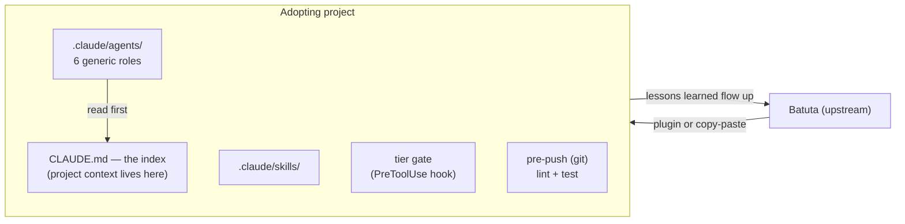
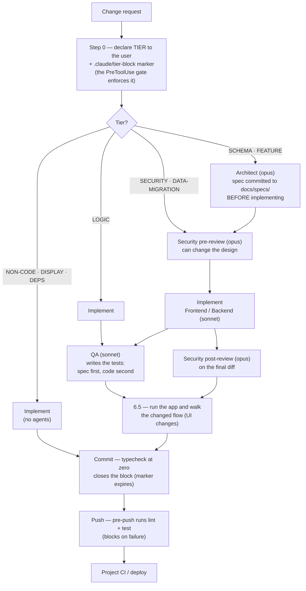

# Batuta

[](LICENSE)
[](https://github.com/Ahlut/batuta/actions/workflows/test.yml)

**The baton belongs to the conductor.** *Batuta* is Portuguese for a
conductor's baton — an AI-first development framework for Claude Code where
one lead agent conducts a team of agents, and **the care each change gets is
measured, not assumed**.

Touch a stylesheet and no reviewer is summoned. Touch logins, payments or the
database and review is mandatory, before and after, with tests. An 8-level
table decides which is which.

> 🇵🇹 **Em português, brevemente:** a Batuta nasceu em português e foi
> traduzida para chegar mais longe. A história original vive no git; issues
> e PRs em português continuam a ser bem-vindos.

Extracted from months of real use building a production SaaS, and repackaged
to bootstrap any new project. This is not theory — it is the process as it
settled out of that real use, with the incidents that shaped it recorded in
the docs (anonymized) instead of erased.

---

## What this is

A set of files to drop into a new project:

- **`CLAUDE.template.md`** — the index Claude reads at the start of every
  session: development flow, tier table, tie-breaks, agent mechanism.
- **`agents/`** — 6 agent definitions (role, when to invoke, expected
  output). Generic by design: project-specific context lives in `CLAUDE.md`,
  which every agent reads first — so the plugin path and the copy-paste
  path produce the same result.
- **`skills/`** — skill skeletons that orchestrate the agents.
- **`hooks/`** — pre-push hook (lint + test) plus installer, and the
  tier-gate hook.
- **`docs/token-costs.md`** — containment rules for agent fan-out cost
  (stack-agnostic, copied as-is).
- **`ADOPTION.md`** — the checklist of per-project decisions.
- **`.claude-plugin/`** — plugin manifest: this repo installs directly
  into Claude Code (see "How to adopt").

The pieces, and the direction the improvement loop flows:



## Philosophy

**Proportionality to risk.** Light process where a mistake is cheap;
rigorous process where it is expensive. This shows up in three places:

1. **The tier table** — 8 levels, from NON-CODE (invokes no agent at all)
   to FEATURE (Architect + Security + QA, mandatory). Reading, analyzing
   and planning never trigger agents; row-level authorization, payments and
   schema always do.
2. **The token-cost overlay** (`docs/token-costs.md`) — the full agent
   fan-out is expensive. The rule is not "fewer agents, always" — it is
   **fan-out scales with risk, not with habit**. An additive one-column
   migration does not deserve the same choreography as a new feature
   touching authorization rules and money.
3. **What is NOT automated** — product decisions, applying SQL in
   production, loops that write code unsupervised. Those stay with a human,
   whatever the tier.

The framework does not exist to add process — it exists so that the process
already worth having (security review before authorization rules, tests
before merging financial logic) happens every time, and the rest doesn't
happen out of habit.

### The flow, at a glance

How a change travels through the framework — the tier decides which agents
run and which gates hold it:



QA and the Security post-review can run in parallel — the code already
exists. The left branch is the point of the framework: reading, analyzing
and copy changes invoke **no agent at all**; the full fan-out is reserved
for where the risk pays for it.

### Why this is not "3 agents, always"

`docs/token-costs.md` was born from a real incident: one feature single-
handedly exhausted a 5-hour session limit because the full flow (Architect
→ Security-pre → Frontend → QA → Security-post) ran 3 times in a row for 3
sub-parts of the same feature, each reprocessing a large context. The lesson
was not "cut security" — it was to scale the choreography to the real risk
of each sub-part, not to the nominal tier of the whole feature.

---

### One agent or many?

A fair objection: "with today's models you want one agent with skills, not
six; it decides for itself what to run in the background and checks its own
pipeline." Half of that is how Batuta already works. There is one lead
agent — the one you talk to. The six files in `agents/` are not six agents
running; they are the role cards the lead agent hands out when the tier
table says a change deserves a second pair of eyes, and it decides when to
do that. The verticals (frontend, backend) are context hygiene, not
architecture — collapse them if your project doesn't need the split. The
model follows the task, not the role: risk decides whether a review
happens, difficulty decides which model does the work.

It also matters which shape the objection is aimed at. The failure numbers
usually cited against multi-agent setups — 1,642 runs across 7 frameworks,
41–87% failure rates, roughly a third of those failures from agents
misaligned with each other (Cemri et al., *Why Do Multi-Agent LLM Systems
Fail?*, arXiv 2503.13657) — measure agents handing work down a chain with
nobody watching. Batuta has no chain. Findings come back to the one context
that holds the decisions, agents never hand work to each other, and a human
signs every commit. The design is a response to those failures rather than
an instance of them, and that is the reason the flow is shaped this way.

The other half is where Batuta deliberately disagrees: the agent grading
its own pipeline. A review inside the same context can still find problems,
but it starts from the implementer's assumptions and inherits its blind
spots. A *skill* loads instructions into that same context; a *subagent*
starts from a fresh one. Separate contexts and restricted permissions make a
review more independent; they do not, by themselves, guarantee that errors
get caught — that is what the tests and the gates are for. And the
restriction is a role signal, not a sandbox: reviewers keep `Bash` (see
"Tools per agent" in the template for the honest note). Separating who
writes from who reviews is older than language models, and nothing in the
current generation removes the reason for it. If a future harness offers
"review in a fresh context with no write tools" natively, the agent files
become a configuration detail. The rule stays.

## How to adopt — plugin or copy-paste

**Via plugin (least friction)** — this repo is a Claude Code plugin
marketplace. In the project where you want the framework:

```
/plugin marketplace add Ahlut/batuta
/plugin install batuta@batuta
```

This installs the **agents**, the **skills** and the **tier-gate PreToolUse
hook** (yes, the gate becomes active on install — that is the point of the
plugin; read `hooks/check-tier-declared.cjs` first, as with any hook). Two
things stay out by nature: the project's `CLAUDE.md` (per-project content —
fill it in from `CLAUDE.template.md`, see the checklist below) and the git
**pre-push hook** (it lives in `scripts/` + `package.json`, see
`hooks/README.md`).

**By copy-paste — 3 scenarios, prompts ready to copy:**

**A. Brand-new project, born from zero** — on GitHub, the **"Use this
template"** button on this repo creates your project repo with Batuta
already inside. First instruction to Claude:

> This repo was born from the Batuta template. Follow ADOPTION.md and the
> README checklist: fill in the CLAUDE.template.md placeholders (rename it
> to CLAUDE.md), install the pre-push hook, and only ask me what you cannot
> decide from the project files.

**B. New project with its own scaffolding** (Vite/Next/etc. already
created — the recommended path in most cases; the framework is process,
not code):

> Clone the Batuta repository into a temporary folder and adopt the
> framework in this project following ADOPTION.md: copy CLAUDE.template.md
> to CLAUDE.md and fill the placeholders with this repo's real stack, copy
> agents/ and skills/ into .claude/, and wire the pre-push hook to the
> lint/test commands this project already has.

**C. Existing project** — incremental adoption, nothing breaks:

> Clone the Batuta repository into a temporary folder, read ADOPTION.md and
> map what this project already has. Adopt in phases: (1) the CLAUDE.md
> with the tier table and the 9-step flow, adapted to the conventions that
> already exist here; (2) the agents; (3) the pre-push hook. Skills and CI
> wait until they hurt. Do not rewrite anything in the project — the
> framework takes effect from the next commit, not retroactively.

**Continuous improvement:** Batuta is the upstream. When a project learns a
new rule, it flows up here; the others pull it in their next session.

**Contributions are welcome** — issues and PRs, especially real
(anonymized) lessons missing here. See `CONTRIBUTING.md` for the golden
rule before proposing a new one. License: MIT (`LICENSE`).

---

## Adoption checklist (~30 min)

The quick checklist — the long version, with the questions behind each
step, lives in `ADOPTION.md`.

1. **Copy files** (5 min)
   ```bash
   cp CLAUDE.template.md /path/to/project/CLAUDE.md
   cp -r agents /path/to/project/.claude/agents
   cp -r skills /path/to/project/.claude/skills
   cp hooks/pre-push hooks/install-hooks.mjs /path/to/project/scripts/
   cp docs/token-costs.md /path/to/project/docs/token-costs.md
   mkdir -p /path/to/project/docs/specs
   ```

2. **Fill in the `CLAUDE.md` placeholders** (10 min) — full list at the top
   of `CLAUDE.template.md`. The main ones:
   - `{{PROJECT_NAME}}` — project name
   - `{{PRODUCT_SUMMARY}}` — one sentence on what the product does
   - `{{ROLES}}` / `{{ROUTES}}` — if the project has distinct roles/routes
   - `{{STACK}}` — the real stack (language, framework, DB, tests)
   - `{{CODE_CONVENTIONS}}` — the project's naming/folder conventions
   - `<!-- ADAPT -->` sections — decide whether and how each one applies

3. **Decide which tiers apply** (5 min) — the template's 8-tier table
   assumes schema + row-level authorization + payments. A project without
   its own database or without money has fewer tiers with weight (see
   `ADOPTION.md` §1).

4. **Wire the pre-push hook** (5 min)
   ```bash
   # package.json (or equivalent)
   "scripts": { "prepare": "node scripts/install-hooks.mjs" }
   ```
   Edit `scripts/pre-push` to the project's real lint/test commands (the
   template assumes `npm run lint` + `npm test` — swap for another stack).
   The installer puts the hook wherever git says hooks live (linked
   worktrees and `core.hooksPath` included) and does not touch a different
   `pre-push` that is already there — merge by hand, or
   `BATUTA_HOOKS=replace npm install` to back it up and replace it.
   Details in `hooks/README.md`.

5. **Decide where the single list of open items lives** (2 min) — keeping
   one single place with everything open (findings, pending decisions,
   follow-ups) prevents the same item from being rediscovered across
   sessions. Pick an equivalent (a file, a board, a pinned issue) and point
   to it from the adapted `CLAUDE.md`.

6. **Dependency cooldown gate — optional** (3 min) — only worth it if the
   project has `npm`/a lockfile and the appetite to maintain
   `scripts/check-dependency-cooldown.mjs` (not included in this template —
   it is ecosystem-specific enough that it deserves a rewrite against the
   new project's real registry/package manager). See the note in
   `hooks/README.md`.

Done. From here on, the 9-step flow in the adapted `CLAUDE.md` is the
process — there is no more setup.

---

## What is NOT here, and why

- **No code from the source product** — no components, no SQL, no business
  logic. This is the process skeleton only.
- **`security-baseline` and `security-status`** did not ship as complete
  skills — they stayed out of the initial batch of 2 (`security-check`,
  `db-migration`) to keep adoption lean; the frontmatter pattern is the
  same, replicate them when the project needs them.
- **An orchestration rituals manual was not copied as-is** — the source
  project has a second, longer document tied to that project's specific
  rituals (isolated working environments per block, its own tools for
  rehearsing migrations, local-machine conventions). The generic sections
  (the per-block work cycle, "what is not automated") were absorbed into
  `CLAUDE.template.md`; the rest is for each project to write as its own
  rituals manual after the rituals exist.
- **No CI workflow for your project** — the source project's CI pipeline
  is tied to its own deploy provider and its own DB-as-a-service;
  ADOPTION.md says what an equivalent pipeline should cover, but writing
  the YAML belongs to the project. (The workflow in this repo tests
  Batuta itself — the hooks and the agent files — not an adopting
  project.)
- **No proof that the review happened** — the tier gate checks that a tier
  was declared, not that the declared reviewers ran on the diff that got
  committed. Step 8 of the flow ("did the promised agents run?") is
  discipline, and the docs say so. The planned next step is evidence tied
  to the diff hash — classification, reviews and test results recorded per
  diff and invalidated when the code changes (see `hooks/README.md`,
  "Planned evolution").

---

## Provenance

Extracted from months of real use building a production SaaS — not theory.
The incidents cited in the docs are real, but described anonymously and
generically, with no product name, no full stack attributed to it and no
calendar dates: a feature that single-handedly exhausted an entire working
session through agent fan-out; a privileged function that lost a guard when
it was recreated by copy instead of edited; a recursive authorization rule
that stayed live unnoticed for a good while. They were kept so the "why"
behind each rule survives the copy, without exposing details of the product
they came from. All of them were fixed at the time; they are here as the
origin of a rule, not as a status report.
